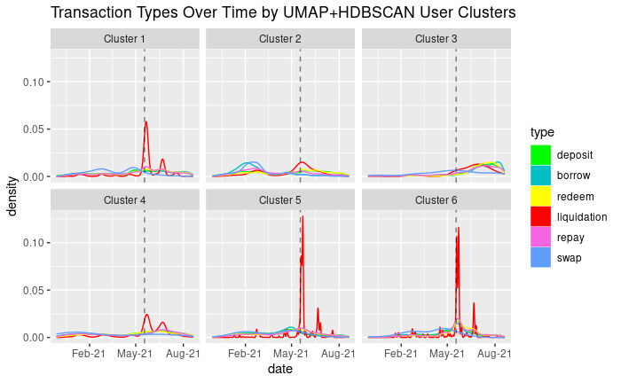

# Github Info

* github repository: https://github.rpi.edu/DataINCITE/IDEA-Blockchain/blob/master/DefiResearch/StudentNotebooks/FinalNotebook/dar_final_kwond2_30nov2021.Rmd
* Your github ID: kwond2 
* Final notebook: dar_final_kwond2_30nov2021.Rmd

* External Notebook References
  * https://github.rpi.edu/DataINCITE/IDEA-Blockchain/blob/master/DefiResearch/StudentNotebooks/Assignment03/kwond2_assignment3.pdf
  
* Github Issues
  * https://github.rpi.edu/DataINCITE/IDEA-Blockchain/issues/86
  
* Contributions 
  * The visuals for the density plots (Cole) and the survival plots (Soumya) were used and modified.
  * The externally referenced notebooks include shared code which is made distinct.
 
* Note to the Reader:
  * This notebook is self-sufficient - it contains all the code embedded to reproduce the analysis given that the file structure of the data is preserved. The PDF provides very little code to be read without clutter.

# Overview & Problems Tackled

In the decentralized finance (DeFi) space, users have significant freedom of the various transactions they can make on the blockchain at any time, from a large selection of cryptocurrencies, and an abundance of blockchain tech that mimics traditional financial intermediaries. Yet, compared to traditional finance, the DeFi space entails a substantially more risk and volatility.
From the general problem of clustering in finance, we mainly explore the subset of characterizing users and identifying groups based on their transaction data, such as high risk groups that make liquidate often or a significant amount, lower risk groups who only deposit to earn a stable return rate, etcetera. 

Particularly, we look at more complex methods of dimensionality reduction (UMAP) and clustering (HDBSCAN) on a modified weekly mean transaction encoded dataset to group our users. From our analysis, we obtain distinct clusters (visually) of users, with transaction types, amounts, and frequencies that have reasonable hypotheses (i.e. group of users with high risk behaviors have high liquidation amounts and frequencies). Finally, we elaborate on a general formulation of the UMAP + HDBSCAN procedure that can be used on other clustering tasks, and other analysis that can be done on the clustered users (i.e. look into frequency of coins by transactions, look into statistically significant survival analysis).


```{r message=FALSE, echo = FALSE}
# Required Packages.
if (!require("umap")) {
  install.packages("umap")
  library(umap)
}
if (!require("dbscan")) {
  install.packages("dbscan")
  library(dbscan)
}
if (!require("ggridges")) {
  install.packages("ggridges")
  library(ggridges)
}
if (!require("data.table")) {
  install.packages("data.table")
  library(data.table)
}
if (!require("lubridate")) {
  install.packages("lubridate")
  library(lubridate)
}
if (!require("ggplot2")) {
  install.packages("ggplot2")
  library(ggplot2)
}
if (!require("knitr")) {
  install.packages("knitr")
  library(knitr)
}
if (!require("dplyr")) {
  install.packages("dplyr")
  library(dp)
}
if (!require("devtools")) {
  install.packages("devtools")
  library(devtools)
}
if (!require("RColorBrewer")) {
  install.packages("RColorBrewer")
  library(RColorBrewer)
}
if (!require("tidyverse")) {
  install.packages("tidyverse")
  library(tidyverse)
}
if (!require("xts")) {
  install.packages("xts")
  library(xts)
}
if (!require("plotly")) {
  install.packages("plotly")
  library(plotly)
}
if(!require("lubridate")) {
  install.packages("lubridate")
  library(lubridate)
}
if(!require("survival")) {
  install.packages("survival")
  library(survival)
}
if(!require("survminer")) {
  install.packages('survminer')
  library(survminer)
}
if(!require("ranger")){
  install.packages("ranger")
  library(ranger)
}
if(!require("ggfortify")){
  install.packages("ggfortify")
  library(ggfortify)
}
if(!require("patchwork")){
  install.packages("patchwork")
  library(patchwork)
}
```

# Data Description

Note: This notebook is meant to be run within the "IDEA-Blockchain/DefiResearch/StudentNotebooks/FinalNotebook" directory. All datasets are access from "IDEA-Blockchain/DefiResearch/Data". 

## Secondary Datasets

Our experiments first read in an AAVE User transactions dataset "transactions_2.csv" as "df_tr" taken with the time range of November 30th, 2020 to August 19th, 2021. It consists of 481,519 rows of user transactions from 6 different transaction types - borrow, repay, liquidation, deposit, redeem, and swap, along with details (29 columns total) regarding those transactions such as amount. The dataset is misleadingly abundant with NA entries, as a feature for a specific transaction type may not have a value for another transaction type. The difference between the original "transactions.Rds" is the fixing the users to start from 1,2, along with a few other columns as summary statistics.

The columns are brought to 31 by adding two more columns with converted "timestamp" to a datetime column "ymd", and a Year-Month-Week string column, "ymd_new", for convenience.

```{r, message = FALSE, warning=FALSE}
# We assume we're in the FinalNotebook Directory.
data_path <- paste(dirname(dirname(getwd())), "/Data", sep = "")
setwd(data_path)
df_tr <- read_csv("transactions_2.csv")
#For convenience, the Lubridate package is used here to add two more columns (total 26+2=28) from "timestamp" into a datetime column "ymd", and a Year-Month-Week string column, "ymd_new".
df_tr$ymd <- as_datetime(df_tr$timestamp) # fix times for the transactions
setDT(df_tr)[, ymd_new := format(as.Date(ymd), '%Y-%m-%V') ] ## '%Y-%m' for just month-year
print("Dataset Range:");print("Earliest:")
df_tr$timestamp %>% min() %>% as_datetime() 
print("Final:")
df_tr$timestamp %>% max() %>% as_datetime() 
df_tr$type %>% unique()
```

For tidiness, we omit the outputs. The Rmd contains the full view.
```{r, message = FALSE, results= FALSE}
print("AAVE Transactions Dataset:")
df_tr %>% head(5)
df_tr %>% str()
print("Summary Statistics:")
df_tr %>% summary()
print("Column Names:")
df_tr %>% colnames()
```

The second data we indirectly use is a modified form of the AAVE User transactions dataset, "df.users", which contains summary statistics by unique user. It consists of 40,659 rows of unique users, with 29 columns/attributes signifying mean statistics for each transaction type (i.e. number of borrows, mean liquidation, etc). Generating this dataset can be sourced from "https://github.rpi.edu/DataINCITE/IDEA-Blockchain/blob/master/DefiResearch/StudentNotebooks/users.Rmd".

```{r, message = FALSE, warning=FALSE}
# We assume we're in the FinalNotebook Directory.
data_path <- paste(dirname(dirname(getwd())), "/Data", sep = "")
setwd(data_path)
df.users <-read.csv("df_users.csv") ## read users parsed csv
df.users <- df.users[, -which(names(df.users) %in% c("X"))] 
```

Once again, the data can be accessed via the Rmd.
```{r, message = FALSE, results= FALSE}
print("Unique Users Transactions Averaged:")
df.users %>% head(5)
df.users %>% str()
print("Summary Statistics:")
df.users %>% summary()
print("Column Names:")
df.users %>% colnames()
```

## Primary Dataset: Generating Weekly Average Features

The primary dataset we use is once again based on the AAVE User transactions dataset, which is contained in the list "df.weekly" (Accessible via "df.weekly[[i]]"). Instead of having a single average value for each unique transaction & user, here we generate a dataset that directly encodes weekly averages - for each week, we compute the users averages for each type of transaction, and store it as a feature. Since there are multiple types of transactions, the "df.weekly" list is indexed by transaction type. For example, "df.weekly[[1]]" would contain unique users' weekly averaged amounts for borrows. We focus on the borrows transactions only, as a majority of the users have borrow transactions. Though, one thing to note is that all users may not do a specific transaction (i.e. there are definitely a large subset of users who don't have liquidations).

For our analysis on the borrows, "df.weekly[[1]]", the data consists of 16,607 unique users, with 41 columns, where 39 of the columns represent a week within our AAVE dataset  time frame, which holds the averaged amount for borrows in that week.

(Source Hidden)
```{r, message = FALSE, results= FALSE, echo = FALSE}
# Code used to generate df.weekly
# Separate datasets into all the types.
# *** df.weekly[[i]] consists of the datasets indexed by transaction type ***. (i.e. for borrows, i == 1.)
df.bytype <- list()
df.weekly <- list()
type_idx <- 1
for (i_type in df_tr$type %>% unique()) { # for each unique type
  df.bytype[[type_idx]] <- df_tr %>% filter(type == i_type) 
  if (i_type == "swap") {
    next
  }
  if (i_type != "liquidation") {
      wk_means <- df.bytype[[type_idx]] %>%
   group_by(user, week = format(as_datetime(timestamp), "%W-%Y")) %>% 
      dplyr::summarise( wk_type_means = mean(amount, na.rm = TRUE), wk_transaction_type_N = n())
    user_avg_tr_n <- aggregate(wk_transaction_type_N ~ user, data = wk_means, FUN = mean, na.rm = TRUE) # compute average transactions for weeks with transactions
    wk_means <- spread(wk_means, week, wk_type_means)
    wk_means[is.na(wk_means)] <- 0;
    wk_means <- aggregate( wk_means[,-(1:2)], list(user = wk_means$user), mean, na.rm = TRUE)
    df.weekly[[type_idx]] <- cbind(wk_means, wk_transaction_type_N = user_avg_tr_n$wk_transaction_type_N) # join the weekly data and the avg wk # of transactions
  }
  else { # Liquidation case. Need to use amountUSDCollateral
      wk_means <- df.bytype[[type_idx]] %>%
   group_by(user, week = format(as_datetime(timestamp), "%W-%Y")) %>% 
      dplyr::summarise( wk_type_means = mean(amountUSDCollateral, na.rm = TRUE), wk_transaction_type_N = n())
    user_avg_tr_n <- aggregate(wk_transaction_type_N ~ user, data = wk_means, FUN = mean, na.rm = TRUE) 
    wk_means <- spread(wk_means, week, wk_type_means)
    wk_means[is.na(wk_means)] <- 0;
    wk_means <- aggregate( wk_means[,-(1:2)], list(user = wk_means$user), mean, na.rm = TRUE)
    df.weekly[[type_idx]] <- cbind(wk_means, wk_transaction_type_N =  user_avg_tr_n$wk_transaction_type_N) 
  }
  type_idx <- type_idx + 1
}
```


```{r, message = FALSE, results= FALSE}
print("Unique Users Averaged Weekly Borrows:")
df.weekly[[1]] %>% head(5)
df.weekly[[1]] %>% str()
print("Summary Statistics:")
df.weekly[[1]] %>% summary()
print("Column Names:")
df.weekly[[1]] %>% colnames()
```


# Results

## Problem 1 

Given that we would like to group users by their transactions that may be useful in characterizing behaviors of risk or profit, a standard dimensionality reduction and clustering method was used (PCA + K-Means). The reference notebook kwond2_assignment3.Rmd (linked above via Github) provides an in-depth analysis of the comparison between the PCA + K-Means versus our method here, UMAP + HDBSCAN. Furthermore, our original AAVE data encoded a high level, full timespan view of the transactions. This resulted in our clusters yielding poorer results when looking for patterns at the weekly transaction level. 

To circumvent these issues, a new, weekly dataset was generated which encoded weekly features (specified above), along with our alternative dimensionality reduction + clustering method.

### Methods

The dataset used was "df.weekly[[1]]", specified in the datasets section of this notebook, which consists of unique user average borrow amounts per week as features. 

UMAP (uniform manifold approximation projection), effectively learns a manifold approximation of the distribution our data lies in (in the simplest case, effectively generating a directed weighted graph via a style of knn), and maps the approximation to a lower dimensional space by minimizing a style of cross entropy error, iteratively minimizing the objective so that close points are weighted close together, and far points are pushed apart.

Afterwards, under the assumption that weekly data may have some special, nonlinear structures, we cluster via a density based approach by HDBSCAN (hierarchical density-based spatial clustering and applications). HDBSCAN is effective in mitigating the issues of some data not being close to means centers in a simpler k-means approach, but being locally close to other points that are locally close to the mean centers. We use a moderately high Minimum Points hyperparameter (100), which determines minimum points required to be a cluster. For the other parameters, we use the default which tend to be good enough for our analysis. The clustering is done in a higher dimensional space (5D) to preserve some of the finer details of the data.

One thing to note is that HDBSCAN does not require the user to specify the number of clusters as a hyperparameter, and in our case is mainly dependent on the MinPts parameter as mentioned above. In our example, we produce 4 clusters, one mainly being an outlier group.


```{r, echo = FALSE}
# For each transaction type, we do not scale since the magnitude of the amounts are important.
umap3_list <- list()
hdb3_list <- list()
for (i in c(1)) { # go up to (1) only, borrows.
  df.temp.type <- df.weekly[[i]][, -which(names(df.weekly[[i]]) %in% c("user"))] # don't include user, and maybe "wk_transaction_type_N"
df.temp.type <-df.temp.type %>% replace(is.na(.),0) # sparse dataframe
set.seed(43)
umap3_list[[i]] <- umap(df.temp.type, n_components = 5, random_state = 43)
minimum_points = 100
set.seed(43)
hdb3_list[[i]] <- hdbscan(umap3_list[[i]]$layout, minPts = minimum_points)
}
```

Figure 1 is the resulting 2D projection of the UMAP dimensionality reduction. Default parameters were used regarding tolerance/convergence/number of iterations, as it is an iterative technique. The algorithm is not deterministic unless a random seed is set.

Figure 2 is the resulting users colored by cluster. HDBSCAN was run on the original dataset mapped to 5D. We omit a legend for the sake of large cluster outputs (HDBSCAN learns the number of clusters unlike K-means, and so may produce a large number of clusters dependent on the HDBSCAN hyperparameters). 
In grey, we have outlier points. The number of outliers are highly dependent on both the UMAP and HDBSCAN parameters.

```{r, echo = FALSE}
df_umap <- data.frame(umap3_list[[1]]$layout)
ggplot(df_umap, aes(x = X1, y = X2))  + geom_point(alpha = 0.1, size= 2,shape = 4) + ggtitle("Fig 1: Unique Users' Weekly Borrows Averages Projected via UMAP") + labs(x = "Standard Basis Vector 1 Domain", y = "Standard Basis Vector 1 Domain")
n_colors = max(hdb3_list[[1]]$cluster)
pre_colors <- rainbow(n_colors)
palette1 <- c("#808080", pre_colors) ## set 0 to a light grey as outliers
color_labels <- vector("character", length = length(hdb3_list[[1]]$cluster))
for (i in 0:n_colors) {
  color_labels[hdb3_list[[1]]$cluster == i] = palette1[i+1]
}
cluster_names <- c("Outliers", c(1:n_colors))
ggplot(df_umap, aes(x=X1, y=X2)) + geom_point(alpha = 0.1, size = 2, shape = 4, colour = color_labels) + ggtitle("Fig 2: Unique Users' Weekly Borrows Averages Clustered via HDBSCAN in 5D w/ 50 MinPts") + labs(x = "Standard Basis Vector 1 Domain", y = "Standard Basis Vector 1 Domain") + guides(colour = guide_legend(override.aes = list(alpha = 1))) + scale_color_manual(labels = cluster_names, values = palette1)
```


### Results

The bulk of our research can be summed into transaction density plots of the various clusters (see appendix and referenced kwond2_assignment4.Rmd for more analysis, and an alternate training run with different clusters). 

In figure 3, the clusters were produced using a random seed of 43, 5 dimensions for UMAP, and 50 MinPts for HDBSCAN. The outlier group had users with large density of swaps within May-21, June-21, and July. Cluster 1 on the other hand grouped users who did moderate amount of borrows within that similar timeline. Cluster 2 does not show much activity throughout time, which likely means they are generally inactive users, doing very few transactions, or transactions spaced out through time. Finally, cluster 3 shows a large density of liquidations between May-21 and June-21, which are likely users who were liquidated from the instability caused by the China crypto ban fiasco in Mid-late May.


```{r, echo = FALSE}
df_borrows <- df.weekly[[1]]
df_borrows["hdb_clusters"] <- hdb3_list[[1]]$cluster
df.4 <- df_borrows
N <- max(df.4$hdb_clusters) 
dict <- table(df.4$hdb_clusters) #
df.dict <- as.data.frame(dict)   # Unused except to sort by top clusters in the next code block
```

```{r, echo = FALSE}
max_clusters <- (df_borrows$hdb_clusters %>% max())+1
topclusters <- top_n(df.dict, n=max_clusters, Freq) %>% arrange(desc(Freq)) # get the top N (N is set to max) sized clusters and their frequencies in sorted order
cluster_transactions = list()
raw_list_of_users = list() 
pick_top_N = max_clusters # pick 3 largest clusters
#topclusters[1:pick_top_N,1]
idx_nooutlier <- 1
colmean_diff <- list()
topclusters <- c(0:(max_clusters-1)) # DO NOT SORT BY SIZE
for (i in 1:pick_top_N) {
  c_idx <- topclusters[i]#topclusters[i,1]
  c_user_idx <- which(df.4$hdb_clusters == c_idx)
c_users_id <- df.users[c(c_user_idx),]
c_users_id_replaced <- c_users_id
#c_users_id_replaced <-c_users_id%>%replace(is.na(.),0)
raw_list_of_users[[idx_nooutlier]] <- c_users_id
df_tr_with_clust <- df_tr[df_tr$user %in% as.list(raw_list_of_users[[idx_nooutlier]]$user),]
df_tr_with_clust$cluster <- c_idx
cluster_transactions[[idx_nooutlier]] <- df_tr_with_clust
idx_nooutlier <- idx_nooutlier + 1
}
```


	
```{r, echo = FALSE}
if (!require("anytime")) {
   install.packages("anytime")
   library(anytime)
}
df_final <- df_tr;
df_final$cluster <- 1
for (i in 0:(max_clusters-1)) { 
  users_from_cluster <- df_borrows[df_borrows$hdb_clusters == i,]$user %>% unique()
  df_final[df_final$user %in% users_from_cluster,]$cluster <- i;
} 
df_final$date<- anydate(df_final$timestamp)
gg_color_hue <- function(n) {
  hues = seq(15, 375, length = n + 1)
  hcl(h = hues, l = 65, c = 100)[1:n]
}
# 6-list of ggplot colors explicitly specified
pgg <- gg_color_hue(6)
cluster_names <- c('0' = "Outliers", '1' = "Cluster 1", '2' = "Cluster 2", '3' = "Cluster 3", '4' = "Cluster 4", '5' = "Cluster 5")
ggplot(data = df_final[!(is.na(df_final$cluster)), ], aes(x = date,  group = type, color = type)) + 
  geom_density() +
  ggtitle("Fig 3: Transaction Types Over Time by UMAP+HDBSCAN User Clusters")+
  geom_vline(xintercept = as.numeric(as.Date("2021-05-18")), linetype=2, alpha = 0.5, color = "black")+
  scale_x_date(date_breaks = "3 months", date_labels = "%b-%y")+
  scale_color_manual("type", values = c("deposit"="green","borrow" = pgg[4], "redeem" = "yellow", "liquidation" = "red","repay"=pgg[6],"swap"=pgg[5]))+
  scale_fill_manual("type", values = c("deposit"="green","borrow" = pgg[4], "redeem" = "yellow", "liquidation" = "red","repay"=pgg[6],"swap"=pgg[5]))+
  facet_wrap(~ cluster, labeller = as_labeller(cluster_names))
  


```


We also output the total number of each type of transaction for each cluster in Table 1. The large spikes in densities for swaps for the outlier group is likely a few users with abnormally large valued swaps, which would make sense as outliers. In cluster 2, despite having a substantial number of transactions, the densities show relatively low probabilities of each type, as the amounts are likely very small. The appendix shows a bit more of this, with stacked bar plots comparing the amounts per type and by cluster.


```{r, include = T, echo = FALSE}
df_total_types <- setNames(data.frame(matrix(ncol = 7, nrow = 0)), c("Cluster","Borrows", "Repays", "Liquidations", "Deposits", "Redeems", "Swaps"))

types_possible <- df_final$type %>% unique()
maxval <- max_clusters - 1
for (i in 0:maxval) {
  type_list <- list()
  if (i==0) { #outlier case
    type_list[[1]] <- i
  }
  else {
    type_list[[1]] <- i 
  }
  for (j in 1:6) { # 6 different types
    typeshape <- df_final[df_final$type == types_possible[j] & df_final$cluster == i,] %>% dim()
    type_list[[j+1]] <- typeshape[1]  
  }
  cluster_types <- unlist(type_list)
  df_total_types <- rbind(df_total_types, cluster_types)
  
}
df_total_types<-  setNames(df_total_types, c("Cluster","Borrows", "Repays", "Liquidations", "Deposits", "Redeems", "Swaps"))
df_total_types[1,1] <- "Outliers"

kable(df_total_types, caption = "Number of Transactions by Cluster")


```


### Discussion

Generally, it seems to be that our new features are not much of an improvement from the non-weekly features, at least without proper tuning of the number of UMAP dimensions and the min points in HDBSCAN (if we compare it to our alternate training run, which is in the appendix). Three clusters do not seem like enough to characterize a few ten thousand users. The issue is likely due to the fact that we limit our dataset to users who have had at least one borrow within our timeframe. For example, it may be the case that a user borrowed earlier than our timeframe, but then liquidated within our timeframe. This user would not be included within our borrow dataset.

However, within the appendix, an alternate training run was done - we are certainly able to cluster users with specific behaviors to a weekly transaction scale. 

The main limitation of the results are the certainty of our hypothesis/intuition. Despite the fact that it may look like our clusters are "good", it may be beneficial to run some cluster metrics, or test the "accuracy" of the clusterings with a synthetic, labeled data set (i.e. manually encode high liquidations or high risk behavior).

## Problem 2

Regarding our clusterings, we've done very little work connecting it to other student work which may provide more insight into the quality of our clusters. We hope that survival analysis of borrows to repays of users by cluster show noticeable differences that match the transaction behavior of the density and bar plots (appendix).
 
### Methods

We use the survminer library (which can be found in the references) to generate our plots. The primary type of survival plot we look at is the first borrow to the "death" of first repay. 

```{r, warning = FALSE, message= FALSE}
generateSurvival <- function(start, end, str_name)
{
  
  dataSet <- left_join(end,start,by="user") %>%
    dplyr::rename(endTime=timestamp.x) %>%
    dplyr::rename(startTime=timestamp.y) %>%
    group_by(user) %>%
    dplyr::summarise(timeDiff=case_when( min(startTime)-min(endTime) >0 ~   min(startTime)-min(endTime), TRUE ~ 21294796)) %>%
    dplyr::mutate(status=case_when(timeDiff==21294796 ~ 0, timeDiff<=0 ~ 0, timeDiff>0 ~ 1)) %>%
    dplyr::select(user,timeDiff,status)
  
  km <- with(dataSet, Surv(timeDiff/86400, status))
  km_fit <- survfit(Surv(timeDiff/86400, status) ~ 1, data=dataSet)
  summary(km_fit, times = c(1,30,60,90*(1:10)))
  p1 <- autoplot(km_fit,xlab="time (days)",ylab="Survival Percent",title="Survival Analysis") + ylim(c(0.9, 1.0)) + ggtitle(str_name)
  return (p1)
}
```
	
### Results

It terms of interpreting the survival plots, it seems that users from cluster 3 generally repay faster/repay in general compared to the overall dataset. We discuss more about figures 4-7 below.
```{r, warning = FALSE, message= FALSE, echo = FALSE}
df_borrows <- df.weekly[[1]]
df_borrows["hdb_clusters"] <- hdb3_list[[1]]$cluster
df.4 <- df_borrows
N <- max(df.4$hdb_clusters) 
dict <- table(df.4$hdb_clusters) #
df.dict <- as.data.frame(dict)   # Unused except to sort by top clusters in the next code block
```

```{r, warning = FALSE, message= FALSE, echo = FALSE}
max_clusters <- (df_borrows$hdb_clusters %>% max())+1
topclusters <- top_n(df.dict, n=max_clusters, Freq) %>% arrange(desc(Freq)) # get the top N (N is set to max) sized clusters and their frequencies in sorted order
cluster_transactions = list()
raw_list_of_users = list() 
pick_top_N = max_clusters # pick 3 largest clusters
#topclusters[1:pick_top_N,1]
idx_nooutlier <- 1
colmean_diff <- list()
topclusters <- c(0:(max_clusters-1)) # DO NOT SORT BY SIZE
for (i in 1:pick_top_N) {
  c_idx <- topclusters[i]#topclusters[i,1]
  c_user_idx <- which(df.4$hdb_clusters == c_idx)
c_users_id <- df.users[c(c_user_idx),]
c_users_id_replaced <- c_users_id
#c_users_id_replaced <-c_users_id%>%replace(is.na(.),0)
raw_list_of_users[[idx_nooutlier]] <- c_users_id
df_tr_with_clust <- df_tr[df_tr$user %in% as.list(raw_list_of_users[[idx_nooutlier]]$user),]
df_tr_with_clust$cluster <- c_idx
cluster_transactions[[idx_nooutlier]] <- df_tr_with_clust
idx_nooutlier <- idx_nooutlier + 1
}
```


```{r, warning = FALSE, message= FALSE, echo = FALSE}
  for (i in 1:max_clusters) {
borrows <- cluster_transactions[[i]] %>%
  filter(type=="borrow")
repays <- cluster_transactions[[i]] %>%
  filter(type=="repay")
if (i == 0) {
  print(generateSurvival(borrows, repays, paste("Fig", i+3,": Outliers: First Borrow to Repay Survival Analysis") ))
} else {
    print(generateSurvival(borrows, repays, paste("Fig", i+3,": Cluster",i-1,": First Borrow to Repay Survival Analysis") ))

}
  }
borrows <- df_tr %>%
  filter(type=="borrow")
repays <- df_tr %>%
  filter(type=="repay")
  
print(generateSurvival(borrows, repays, paste("Fig", i+4, ":Entire Dataset: First Borrow to Repay Survival Analysis") ))
```


### Discussion

The results of the survival plots fall flat, effectively tellng us that our clusterings are not very ideal in this case - it is is likely there are size differences among our clusters (the appendix also includes some of the comparisons of mean amount rather than densities which tells us about how the cluster sizes are skewed). Raising the the minimum number of points along with clustering on a larger dimension space may improve results.

One of the main limitations of the survival plots here is once again similar to the clustering problem - visual inspection and comparison may lead to dangerous or misleading conclusions. There does exist a statistically significant variant that could be used to make more definitive claims. Of course, this would be contingent on improving/enforcing a certain cluster size to guarantee enough samples per cluster/survival plot.

Furthermore, looking into other type of survival/death (i.e. rather than doing borrows to repays, consider deposits), may provide some insight on a set of good clusters. The hierarching theme here is our clusters actually did not perform optimally, as we have some clusters that are too small to have meaningful weight behind them.

# Summary and Recommendations

DeFi data is very difficult to work with regarding clustering, and doing hyperparameter search to find optimal, intuitive clusterings can easily be done, and would definitely improve upon the results. Also, developing better features is always a difficult task that could be improved on. Formulating a way to incorporate all transaction types weekly averages rather than just using borrows could result in different clusters as well, since for our analysis we only looked at the borrowers data. As a start, one could look into the other transaction datasets (i.e. df.weekly[[5]], for example, tracks unique users with at least one liquidation).

Regarding these specific results, I'd advocate against using the hyperparameters selected here, as our clusterings were very poor this iteration. There is a great deal of expandability that can be done not only in the user data space, but clustering coins as well, or looking at the types of coins a cluster of users may transact with.

For survival analysis, only a shallow depth was explored. Looking into the statistical significance of the survival plots would be useful to make mathematical claims rather than visual ones.


# References

The following are references to official libraries/docs (which links the original papers) of the main algorithms used.

* https://umap-learn.readthedocs.io/en/latest/
* https://cran.r-project.org/web/packages/umap/vignettes/umap.html
* https://hdbscan.readthedocs.io/en/latest/how_hdbscan_works.html
* https://cran.r-project.org/web/packages/dbscan/vignettes/hdbscan.html
* https://cran.r-project.org/web/packages/survminer/index.html

# Appendix

Here, we provide the results to the density plots for an alternate UMAP + HDBSCAN clustering run. UMAP is an iterative problem and may change depending on the random seed. Recall that HDBSCAN then learns the best number of clusters. It is not a hyperparameter that you need to tune. However, depending on the MinPts hyperparameter (for HDBSCAN), you may get different cluster sizes, and cluster numbers.


```{r, out.width="5\\linewidth", include=TRUE, fig.align="center", fig.cap=c("Alternative Transaction Types Over Time by UMAP+HDBSCAN User Clusters"), echo=FALSE}

```
The clustering was able to group two large liquidation groups of users, Cluster 4 and 5, and more stable borrows such as clusters 1 and 2 (though it looks like our clustering located time as a pattern, as cluster 2 transactions happen in late May).

```{r, echo = FALSE}
df_borrows <- df.weekly[[1]]
df_borrows["hdb_clusters"] <- hdb3_list[[1]]$cluster
df.4 <- df_borrows
N <- max(df.4$hdb_clusters) 
dict <- table(df.4$hdb_clusters) #
df.dict <- as.data.frame(dict)   # Unused except to sort by top clusters in the next code block
```

```{r, echo = FALSE}
max_clusters <- (df_borrows$hdb_clusters %>% max())+1
topclusters <- top_n(df.dict, n=max_clusters, Freq) %>% arrange(desc(Freq)) # get the top N (N is set to max) sized clusters and their frequencies in sorted order
cluster_transactions = list()
raw_list_of_users = list() 
pick_top_N = max_clusters # pick 3 largest clusters
#topclusters[1:pick_top_N,1]
idx_nooutlier <- 1
colmean_diff <- list()
topclusters <- c(0:(max_clusters-1)) # DO NOT SORT BY SIZE
for (i in 1:pick_top_N) {
  c_idx <- topclusters[i]#topclusters[i,1]
  c_user_idx <- which(df.4$hdb_clusters == c_idx)
c_users_id <- df.users[c(c_user_idx),]
c_users_id_replaced <- c_users_id
#c_users_id_replaced <-c_users_id%>%replace(is.na(.),0)
raw_list_of_users[[idx_nooutlier]] <- c_users_id
df_tr_with_clust <- df_tr[df_tr$user %in% as.list(raw_list_of_users[[idx_nooutlier]]$user),]
df_tr_with_clust$cluster <- c_idx
cluster_transactions[[idx_nooutlier]] <- df_tr_with_clust
idx_nooutlier <- idx_nooutlier + 1
}
```


Here, we plot a baseline stacked barplot to understand weekly transactions within the general dataset.

```{r, echo = FALSE}
# Plot baseline stacked barplot for weekly transaction averages.
# generate N list of custom colors
gg_color_hue <- function(n) {
  hues = seq(15, 375, length = n + 1)
  hcl(h = hues, l = 65, c = 100)[1:n]
}
# 6-list of ggplot colors explicitly specified
pgg <- gg_color_hue(6)
# Start plotting weekly by time. Start with all Users first
df_tr %>% 
  dplyr::count(ymd_new, type, wt = amount, name = "amount") %>% 
ggplot() + 
  geom_bar(aes(x=ymd_new,y= amount, fill = type),
           stat='identity') + ggtitle("Fig 3: ALL Users Transactions Weekly From Jan 2021 to Aug 2021") + labs(y = "Amount (USD)", x= "Time (Weeks)")+
          theme(
           axis.text.x=element_blank(),
           axis.ticks.x=element_blank())+
          scale_fill_manual("type", values = c("deposit"="green","borrow" = pgg[4], "redeem" = "yellow", "liquidation" = "red","repay"=pgg[6],"swap"=pgg[5]))
```

```{r, echo = FALSE}
# Once again, a bit of data preprocessing.
deposit_only <- list()
liquidation_only <- list()
repay_only_list <- list()
redeem_only_list <- list()
borrow_o <- list()
for (i in 1:max_clusters) {
  dep_only_rows <- cluster_transactions[[i]][cluster_transactions[[i]]$type == "deposit",]
  liq_only_rows  <- cluster_transactions[[i]][cluster_transactions[[i]]$type == "liquidation",]
  rep_r <-  cluster_transactions[[i]][cluster_transactions[[i]]$type == "repay",]
  red_r <-  cluster_transactions[[i]][cluster_transactions[[i]]$type == "redeem",]
  bor_r <-  cluster_transactions[[i]][cluster_transactions[[i]]$type == "borrow",]  
  dep_only_rows$cluster <- i
  liq_only_rows$cluster <- i
  rep_r$cluster <- i
  red_r$cluster <- i
  bor_r$cluster <- i
  deposit_only[[i]] <- dep_only_rows
  liquidation_only[[i]] <- liq_only_rows
  repay_only_list[[i]] <- rep_r
  redeem_only_list[[i]] <- red_r
  borrow_o[[i]] <- bor_r
  #print(dim(deposit_only[[i]]))
  deposit_only[[i]]$amount <- deposit_only[[i]]$amount/dim(deposit_only[[i]])[1]
  repay_only_list[[i]]$amount <- repay_only_list[[i]]$amount/dim(repay_only_list[[i]])[1]
  redeem_only_list[[i]]$amount <- redeem_only_list[[i]]$amount/dim(redeem_only_list[[i]])[1]
  borrow_o[[i]]$amount <-borrow_o[[i]]$amount/dim(borrow_o[[i]])[1]
  liquidation_only[[i]]$amountUSDCollateral <- liquidation_only[[i]]$amountUSDCollateral/dim(liquidation_only[[i]])[1]
}
dep.c<- deposit_only %>% rbindlist()
red.c <- redeem_only_list %>% rbindlist()
liq.c <-  liquidation_only %>% rbindlist()
rep.c <- repay_only_list %>% rbindlist()
bor.c <- borrow_o %>% rbindlist()
# Plot by transaction type weekly
loop_labels <- c("deposit", "redeem", "repay", "borrow", "liquidation")
cap_loop_labels <- c("Deposits", "Redeems", "Repays", "Borrows", "Liquidations")
facet_data_list <- list(dep.c, red.c, rep.c, bor.c, liq.c)
```

Here, we plot the averaged (by number of unique users per cluster) of amount USD deposits, redeems, repays, and borrows weekly. The stacked values indicate the amount for that specific cluster. 
Remark: Recall the weekly features were generated based on borrows, so the clustering will likely find distinct differences mainly in the borrows. However, we know that all the transaction types are generally highly correlated weekly.

As we mentioned earlier, we see that there is a great imbalance in terms of value of transactions per cluster.

```{r, echo = FALSE}
fct_plot_list <- list()
for (m in 1:4) {
  pltobj <- ggplot(dplyr::count(facet_data_list[[m]] ,ymd_new, cluster, wt =amount, name = "amount")) + 
  geom_bar(aes(x=ymd_new,y= amount, fill = as.factor(cluster)),
           stat='identity') + ggtitle(paste0("Averaged ", cap_loop_labels[m], " of Users by Cluster\n Weekly From Jan 2021 to Aug 2021")) + labs(y = "Amount (USD)", x= "Time (Weeks)")+
          theme(
           axis.text.x=element_blank(),
           axis.ticks.x=element_blank()) + labs(fill="Largest Clusters")
  print(pltobj)
  fct.plt <- pltobj +  facet_grid(cols = vars(cluster))
  fct_plot_list[[m]] <-fct.plt
  
  
  
}
# threshold 
facet_data_list[[5]][facet_data_list[[5]]$amountUSDCollateral < 1] <- 1 # threshold for the small transaction values
  pltobj <- ggplot(dplyr::count(facet_data_list[[5]] ,ymd_new, cluster, wt = amountUSDCollateral, name = "amountUSDCollateral")) + 
  geom_bar(aes(x=ymd_new,y= amountUSDCollateral, fill = as.factor(cluster)), ## adjust via log10()
           stat='identity') + ggtitle(paste0("Averaged ", cap_loop_labels[5], " of Users by Cluster\n Weekly From Jan 2021 to Aug 2021")) + labs(y = "Amount (USD)", x= "Time (Weeks)")+
          theme(
           axis.text.x=element_blank(),
           axis.ticks.x=element_blank()) + labs(fill="Largest Clusters")
  print(pltobj)
  fct.plt <- pltobj +  facet_grid(cols = vars(cluster))
  fct_plot_list[[5]] <- fct.plt
  
for (m in 1:5) {
  print(fct_plot_list[[m]])
}
```